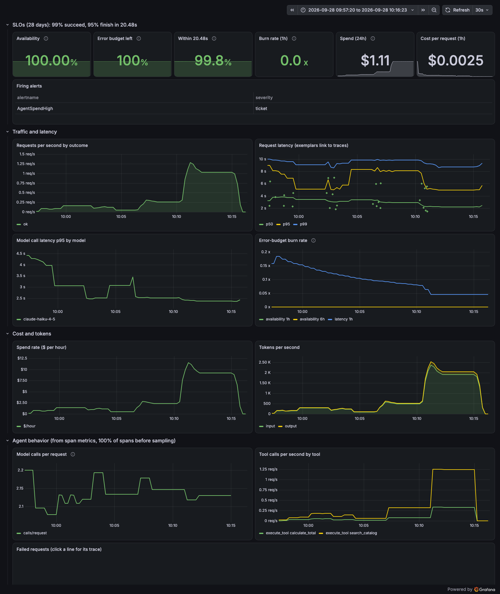

# llm-span-and-spend

Observe a Claude agent the way an SRE observes any production service: traces, metrics,
logs, SLOs, alerts, and a load test. Plus the one number most AI demos skip, which is
what each request costs.

Read the results: [What an AI agent looks like through an SRE's eyes](docs/results.md).

Everything runs locally with `docker compose up`. Instrumentation is OpenTelemetry. The
backend is a self-hosted Grafana stack (Tempo, Loki, Prometheus, Grafana).


The trace above is one real request. The three searches took 19 to 55 microseconds. The
four model calls took 5.7 seconds. Every tool retry costs a full, paid model round trip,
and without traces you would never see it.

## Why this is worth doing

Most teams ship an agent and then watch two numbers: the monthly bill and the complaints.
Both arrive late, and neither says what to fix. This project shows the alternative. Treat
the agent like any production service, and it starts answering the questions leaders,
on-call engineers, and finance actually ask.

### "Where does the money go?"

Every span carries its token count and its dollar cost, and every request rolls them up.
Cost per request becomes a live metric, next to latency and errors, instead of a line on
next month's invoice.

In this project it cost $0.0025 per request on Claude Haiku 4.5. That number held flat
from 1 user to 20. It is the unit economics of the feature, and you can forecast from it.

### "What should we fix first?"

A slow request tells you nothing. A trace tells you why. The waterfall above showed three
searches taking microseconds and four model calls taking 5.7 seconds. Span metrics then
counted the pattern across every request: 431 searches for 113 totals. The weak spot was
not the model or the infrastructure. It was a search tool that forced the model to retry,
and every retry was a paid round trip.

That is a fix you can size before you build it, because the metrics that exposed the
problem will also measure the result.

### "How far can it scale, and what breaks first?"

A load test with a hard request cap answered this for about a dollar. At 20 users the
agent served about 7.6 requests per second with zero failures and got faster under load.
What gave out first was the budget: about $69 an hour at that rate. Knowing your ceiling is
money, not capacity, changes how you plan quotas, pricing, and model choice.

### "Will we know before users do?"

Two SLOs define "good": 99% of requests succeed, and 95% finish within 20.48 seconds.
Burn-rate alerts page when the error budget drains fast and open a ticket when it drains
slowly. A separate guardrail opens a ticket when spend passes $1 an hour. It fired during
the load test, which is exactly when you want it to.

Synthetic test traffic is excluded from every SLO, so testing the system never pages
anyone.

### "Are we storing what users typed?"

Not by default. Spans carry counts, ids, and outcomes. When prompt capture is turned on for
debugging, the Collector deletes prompt and answer text before anything is stored. The
policy lives in one place instead of in every service, and a test proves it.

### "Can we trust these numbers?"

Every claim in this repo has a check behind it. Unit tests cover the code at 100%. A
verification script proves five Collector behaviors against the live stack. Prometheus
rule tests cover every alert. Dashboard tests stop drift and bad queries. The load test's
spend matched the cost metric within 1%.

The checks caught real mistakes along the way: a bug that 100% line coverage missed, a log
filter that ran without error and filtered nothing, and a peak rate misread by a factor of
seven. Each one is written up in the results.

### "What does it cost to adopt?"

Very little. It is built on OpenTelemetry, an open standard, so moving to another backend
means changing the Collector's exporters, not the application. The whole stack runs on a
laptop with one command. All the live API calls in this project, including the load test,
cost under $1.25.

### The numbers

| Question | Answer from this project |
|---|---|
| Cost per request | $0.0025 (Haiku 4.5), flat from 1 to 20 users |
| Throughput at 20 users | ~7.6 requests per second, 0% failures |
| Spend at that rate | ~$69 per hour |
| Where time goes in one request | 5.7s in 4 model calls; tools under 0.2ms total |
| Wasted work | 431 searches for 113 totals across 390 requests |
| Cost metric vs load tool | $0.98 vs $0.97 (1% gap) |
| Prompt text stored | None, verified by test |
| Total API spend for everything | Under $1.25 |

## What it shows

- **A span for every model call and tool call**, following the OpenTelemetry GenAI
  semantic conventions (still experimental), with token counts and dollar cost on each.
- **A Collector that earns its place.** It strips prompt text, tail-samples (keeps every
  error, 10% of successes), and builds metrics from 100% of spans before sampling.
- **SLOs as code.** 99% availability and 95% under 20.48s, with multi-window burn-rate
  alerts and unit tests for every rule.
- **A dashboard generated from Python**, provisioned so it opens with no login.
- **A load test that finds the real constraint.** At 20 users the agent served about 7.6
  requests per second with no errors. Cost, about $69 an hour, gave out first.

```
agent ──OTLP──▶ OpenTelemetry Collector
                  traces/in:  strip prompt text ─▶ span_metrics (100% of spans) ─▶ Prometheus
                                               └─▶ forward
                  traces/out: tail sampling (all errors, slow > 20s, 10% of the rest) ─▶ Tempo
                  logs:       strip prompt text ─▶ Loki (trace_id links each line to its trace)
                  metrics:    app metrics + span_metrics ─▶ Prometheus (native OTLP)
```

Each request produces one trace:

```
invoke_agent catalog-agent        tokens and dollar cost rolled up for the whole request
├── chat claude-sonnet-5          one span per model call: tokens, cost, finish reason
├── execute_tool get_product      one span per tool call: tool name, call id, errors
└── chat claude-sonnet-5
```

Spans carry counts, ids, and outcomes. Prompt and answer text stay off them unless you
opt in (see Prompt capture), and even then the Collector removes it before storage.

## Run it

```bash
docker compose up -d                      # Collector, Tempo, Loki, Prometheus, Grafana (:3001, admin/admin)
cp .env.example .env                      # add your ANTHROPIC_API_KEY
set -a; source .env; set +a
uv run uvicorn --factory agent.app:build_app --port 8000
curl -s localhost:8000/ask -H 'content-type: application/json' \
  -d '{"question": "What does a 2-person tent plus a canister stove cost and weigh?"}'
```

Then open http://localhost:3001. The dashboard is the home page. To see one request as a
waterfall, copy a `trace_id` from a log line into the Trace viewer dashboard, or sign in
(admin/admin) and use Explore with Tempo.
Tail sampling keeps 10% of successful traces, so set `TRACE_SAMPLE_PERCENT=100` before
`docker compose up` if you want to see every one while exploring.

## Prove the Collector policies

```bash
OTEL_EXPORTER_OTLP_ENDPOINT=http://localhost:4317 uv run python scripts/verify_stack.py
```

Sends 60 traces through the real agent code with a fake Claude client ($0), then checks:
errors are always kept, successes are sampled, captured prompt text never reaches Tempo,
each request's log line links to its trace, and span metrics count all 60 requests.

## SLOs and alerts

| SLO | Target | Budget (28 days) |
|---|---|---|
| Availability: requests end with `outcome="ok"` | 99% | 1% |
| Latency: requests finish in 20.48s or less | 95% | 5% |

`prometheus/rules/slo.yml` records error and slow ratios over 5m, 30m, 1h, and 6h, and
alerts with the multi-window, multi-burn-rate pattern from the Google SRE Workbook:
page at 14.4x burn (1h and 5m), ticket at 6x (6h and 30m). A separate guardrail opens a
ticket when model spend passes $1 an hour. Synthetic traffic from `verify_stack.py` is
excluded from every SLO query.

The rules have unit tests:

```bash
docker run --rm -v "$PWD/prometheus/rules:/rules:ro" --entrypoint promtool \
  prom/prometheus:v3.14.0 test rules /rules/slo_test.yml
```

## Dashboard

Grafana opens straight to the dashboard at http://localhost:3001 (read-only, no login).
It is generated from `scripts/build_dashboard.py`; edit that file, never the JSON:

```bash
uv run python scripts/build_dashboard.py     # regenerate grafana/dashboards/catalog-agent.json
uv run python scripts/verify_dashboard.py    # run every panel query against the live stack
```

Rows: SLOs and firing alerts, traffic and latency (with exemplars that link to traces),
cost and tokens, and agent behavior from span metrics (model calls per request, tool calls).

## Load test

`load/k6-agent.js` runs 1, 5, then 20 concurrent users, 15 requests each. The request
count is capped by construction (390), so the cost is too.

```bash
k6 run load/k6-agent.js                              # full run, ~9 minutes, ~$1 on Haiku
ITERS=1 STAGE_GAP_S=90 k6 run load/k6-agent.js       # smoke, 26 requests
```

Results, 2026-09-28, `claude-haiku-4-5`, one local agent process:

| Users | Throughput | Median | p95 | Failed | $/request | Model calls/request | Spend rate |
|---|---|---|---|---|---|---|---|
| 1 | ~0.26 req/s | 4.1s | 7.1s | 0% | $0.0025 | 2.13 | ~$2/hour |
| 5 | ~1.5 req/s | 2.9s | 6.2s | 0% | $0.0025 | 2.15 | ~$13/hour |
| 20 | ~7.6 req/s | 2.2s | 4.9s | 0% | $0.0025 | 2.13 | ~$69/hour |

Throughput is users divided by average latency (k6 users loop with no think time).
Spend rate is throughput times $0.0025 times 3600.

Total: 390 requests, $0.97 by k6's count and $0.98 by the `llm_cost_usd_total` metric
(the 1% gap is `increase()` extrapolating to the window edges). No upstream 429s.

What it showed:

- **20 users did not find the limit.** At ~7.6 requests per second latency fell and
  nothing failed. The knee is higher. The drop in latency under load is unexplained; I
  have not tested a cause.
- **Cost scales linearly and is the real constraint.** At the 20-user rate this agent
  spends about $69 an hour at list price, while still fast. Cost per request did not move
  with load. `AgentSpendHigh` went from pending to firing after the run (Prometheus
  `/api/v1/alerts`, and the Firing alerts panel in the screenshot below).
- **Search is the expensive tool.** Over the run, span metrics counted 431
  `search_catalog` calls and 113 `calculate_total` calls, about 3.8 to 1. The search tool
  matches substrings only ("2-person" misses "Two-person"), so the model retries with
  new wording, and each retry is a paid model call.
- **The dashboard's 5-minute rate windows flatten short bursts.** The 20-user stage lasted
  about 40 seconds, so the panels show ~1 request per second and ~$10 an hour, not the
  real peak. Read peaks from k6; read sustained rates from the dashboard.



## Prompt capture

Off by default. `OTEL_INSTRUMENTATION_GENAI_CAPTURE_MESSAGE_CONTENT=true` puts prompt and
answer text on chat spans as `gen_ai.input.messages` and `gen_ai.output.messages`. The
Collector deletes both before storage. The policy lives in one place, not in every service.

## Test it

```bash
uv run pytest --cov=agent
```

Tests use a scripted fake Claude client and an in-memory span exporter. No API key needed.

## Cost

`agent/pricing.yaml` holds dated list prices. Every chat span carries `llm.cost.usd`; the
root span carries the request total. An unknown model raises instead of reporting $0.

## Metrics

| Prometheus series | What it answers |
|---|---|
| `gen_ai_client_token_usage` (by `gen_ai_token_type`) | Input vs output tokens per model call |
| `gen_ai_client_operation_duration_seconds` | Latency of each model call, with `error_type` on failure |
| `llm_agent_request_duration_seconds` (by `outcome`) | End-to-end latency; the SLO input |
| `llm_agent_request_cost` | Dollar cost per request at list price |
| `llm_cost_usd_total` (by model) | Running spend, including failed requests that were still billed |

Example: average cost per request is
`sum(llm_agent_request_cost_sum) / sum(llm_agent_request_cost_count)`.

## Roadmap

1. Agent, GenAI spans, all-in-one stack (done)
2. Token, cost, and latency metrics (done)
3. Dedicated Collector: span metrics, prompt redaction, tail sampling, logs linked to traces (done)
4. Dashboards and SLOs as code, burn-rate alerts (done)
5. k6 load test at 1, 5, and 20 users: latency, 429s, and dollars per request (done)
