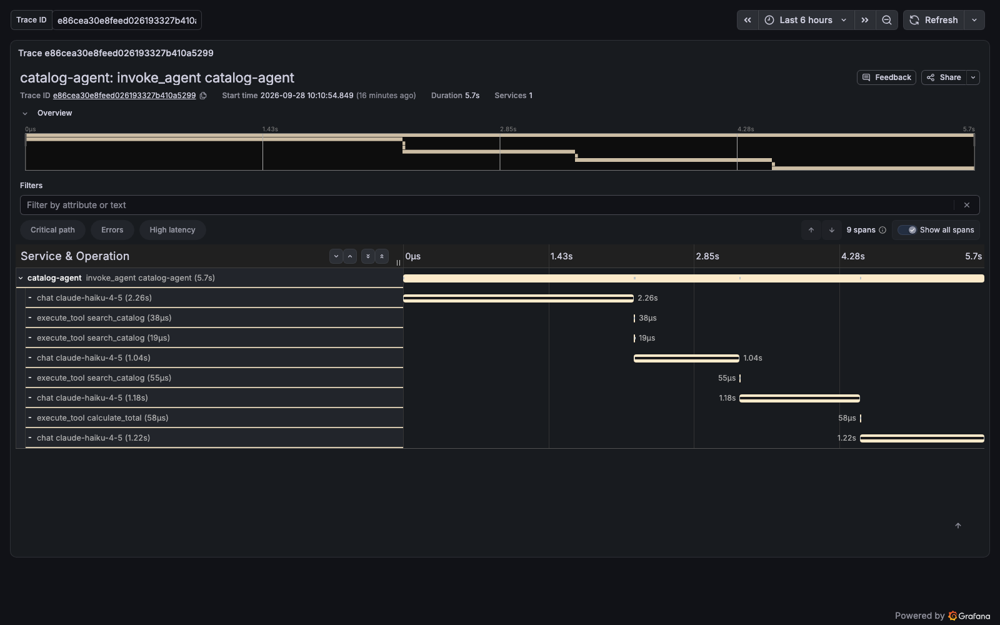
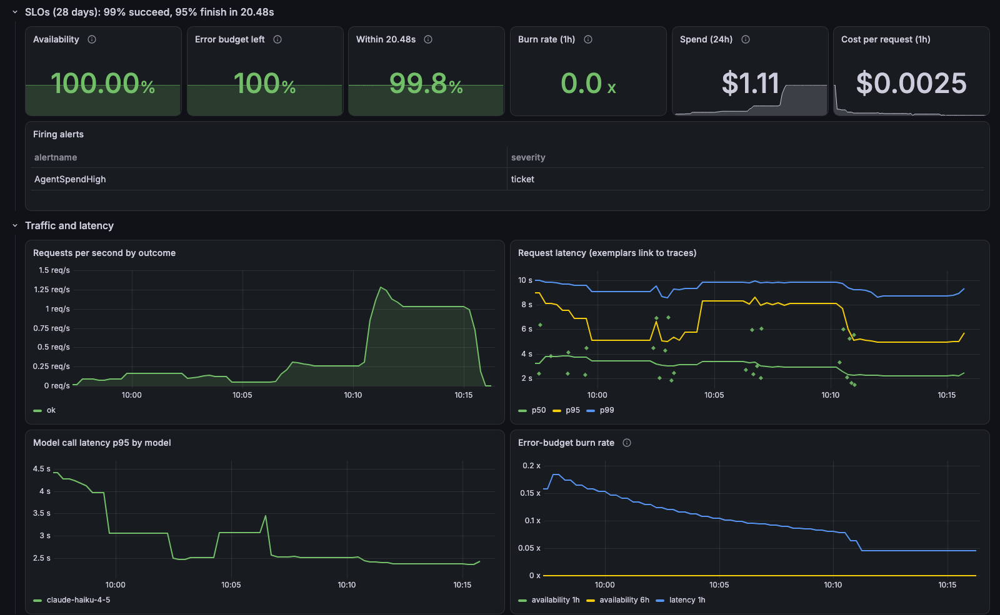

# What an AI agent looks like through an SRE's eyes

I have spent most of my career watching production systems. Payments, ordering, auctions.
The job is always the same: make the system tell you what it is doing, decide what "good"
means, and get told early when it stops being good.

AI agents are production systems now. Most of the observability demos I see stop at "here
is a trace." So I built the rest: an agent, instrumented end to end, with the same tools I
would put on any service I was on call for.

This is what it showed me.

## What I built

A small agent answers questions about an outdoor-gear catalog. It uses Claude and three
tools: search the catalog, look up a product, add up a price. Around it sits a standard
stack. OpenTelemetry (the open standard for traces, metrics, and logs) instruments the
code. An OpenTelemetry Collector processes the data. Tempo stores traces, Loki stores logs,
Prometheus stores metrics, and Grafana shows all of it. Everything runs on a laptop with
one command.

Every request produces a trace. Every model call and every tool call is a span, with the
tokens it used and what it cost in dollars.

## The first thing a trace told me

This is one real request. The question needed a search and a total. The agent searched
three times, because my search tool only matches exact text. "2-person" does not match
"Two-person," so the model tried again with new words.

Look at the timing. The three searches took between 19 and 55 microseconds. The four model
calls took 5.7 seconds. The tools are free. The thinking is not. Each retry is a full,
paid round trip to the model.

Without the trace, this request just looks slow. With it, the fix is obvious: a better
search tool saves time and money on every question.

## Deciding what "good" means

I wrote two service level objectives (SLOs), the promises a service makes to its users:

- 99% of requests succeed.
- 95% of requests finish within 20.48 seconds.

Both live in code as Prometheus rules. Alerts fire on burn rate, meaning how fast the
error budget is being spent, using the multi-window pattern from Google's SRE Workbook.
Burn 14.4 times too fast and it pages someone. Burn 6 times too fast and it opens a ticket.

The rules have unit tests. One test proves that my own synthetic test traffic cannot page
anyone. I proved that test works by deleting the filter and watching it fail.

I also added a guardrail that is not an SLO: open a ticket if the agent spends more than
$1 in an hour.

## Pushing on it

I ran a load test with k6 at 1, 5, and 20 simultaneous users, 390 requests in all, on
Claude Haiku 4.5.

| Users | Requests per second | Median time | Failures | Cost per request |
|---|---|---|---|---|
| 1 | about 0.26 | 4.1s | 0% | $0.0025 |
| 5 | about 1.5 | 2.9s | 0% | $0.0025 |
| 20 | about 7.6 | 2.2s | 0% | $0.0025 |

Nothing broke. No errors, no rate limits, and it got faster under load. I have not tested
why.

The whole run cost $0.97. The cost metric in Prometheus said $0.98. The 1% gap comes from
how Prometheus estimates increases at the edges of a time window.

Here is the finding that matters. At the 20-user rate this agent spends about $69 an hour,
while still fast and still error-free. Money runs out long before capacity does. The spend
guardrail fired during the test, which is the point of having it.

The tool counts backed up the trace. Over the run the agent called search 431 times and
the totals tool 113 times, almost 4 to 1. That ratio is the search problem, measured
across every request instead of one.

## What I got wrong

Three mistakes, each caught by a check I built for exactly that reason.

**100% test coverage hid a real bug.** Every line was tested, but when the model stopped
because it ran out of room, the agent returned the half-finished answer as a success. My
tests only ever used the normal stop reason. A code review caught it. Now there is one test
per possible stop reason.

**A log filter that filtered nothing.** My dashboard was supposed to hide test traffic
from the error log panel. It showed 50 test errors. In Loki, the label I filtered on was
not an indexed label, and a "not equal" match on a missing label matches everything. The
query ran without error. Only looking at the rendered panel exposed it.

**I misread the peak.** I first reported about 1 request per second and $9 an hour. The
dashboard averages over 5 minutes, and the 20-user burst lasted about 40 seconds. The real
peak was 7 times higher. Read peaks from the load tool. Read steady rates from the
dashboard.

## What I would tell a team shipping an agent

1. Put dollars on every span. Cost per request is an operational metric, not a finance
   report.
2. Trace tool calls, not just model calls. The expensive part is often a cheap tool
   causing extra model round trips.
3. Write SLOs before you need them, and test the alert rules like code.
4. Load test for cost, not only for speed. Your ceiling may be the budget.
5. Keep prompts out of your telemetry by default, and enforce it in one place. Here the
   Collector strips prompt and answer text before anything is stored.

The whole project, code, dashboards, and tests, is open source. It runs on a laptop, and
the load test costs about a dollar.
